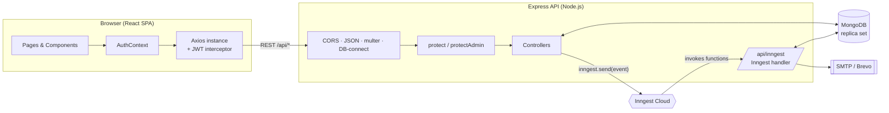
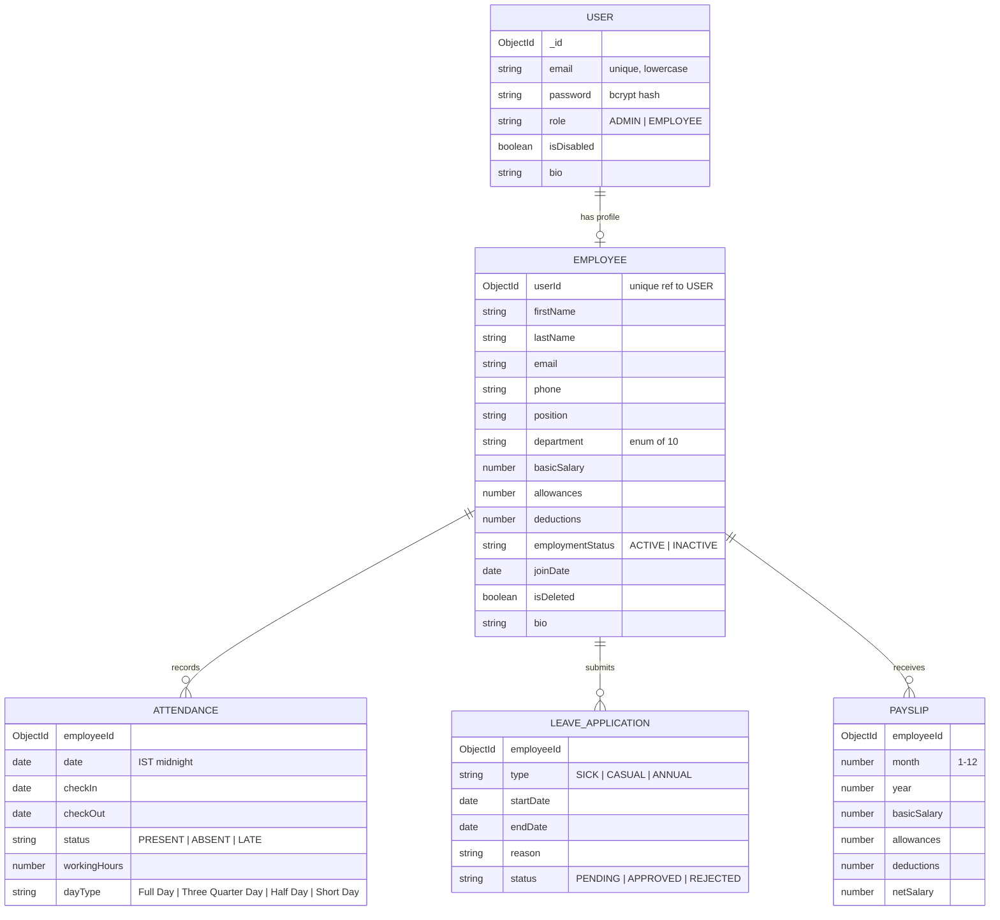

# 🧭 WorkPilot — Employee Management System

**A full-stack MERN application for managing employees, attendance, leave, and payroll, with separate Admin and Employee portals.**


</div>

---

## 📑 Table of Contents

1. [Overview](#-overview)
2. [Features](#-features)
3. [Tech Stack](#-tech-stack)
4. [Architecture](#-architecture)
5. [Project Structure](#-project-structure)
6. [Data Model](#-data-model)
7. [Business Rules](#-business-rules)
8. [Background Jobs (Inngest)](#-background-jobs-inngest)
9. [API Reference](#-api-reference)
10. [Getting Started](#-getting-started)
11. [Environment Variables](#-environment-variables)
12. [Available Scripts](#-available-scripts)
13. [Testing](#-testing)
14. [Deployment (Vercel)](#-deployment-vercel)
15. [Security Notes](#-security-notes)
16. [Roadmap](#-roadmap)
17. [Contributing](#-contributing)
18. [License](#-license)

---

## 🔎 Overview

**WorkPilot** is an HR / employee management platform built on the MERN stack. It gives organizations two dedicated portals:

- **Admin Portal** — create and manage employees, review leave requests, generate payslips, and view organization-wide stats.
- **Employee Portal** — clock in/out, view attendance history, apply for leave, download payslips, and manage a personal profile.

Beyond basic CRUD, WorkPilot automates routine HR follow-ups with **Inngest** background workflows: automatic check-out reminders, daily "you haven't checked in" emails, and escalation emails to the admin when a leave request sits unanswered for 24 hours.

<!--
📸 Screenshots: add images to a /docs folder and reference them here, e.g.

-->

---

## ✨ Features

### 🔐 Authentication & Authorization
- Two separate login portals (`/login/admin` and `/login/employee`); the server verifies the account's role matches the portal selected.
- JWT-based sessions (7-hour expiry) sent as `Authorization: Bearer <token>`.
- Passwords hashed with **bcrypt**.
- Role is re-read from the database on every request, so role changes and account deactivation take effect immediately, even for tokens that are already issued.
- Change-password flow from the Settings page.

### 👥 Employee Management *(Admin)*
- Create an employee and its login account together in a single **MongoDB transaction**.
- Edit employee details, role, or reset a password.
- Filter by department and search by name or position.
- **Soft delete**: removing an employee marks the profile `isDeleted`, sets status `INACTIVE`, and disables the linked login. Historical records stay intact.
- 10 predefined departments: Engineering, Human Resources, Marketing, Sales, Finance, Operations, IT Support, Customer Success, Product Management, Design.

### 🕒 Attendance *(Employee)*
- One-click **Clock In / Clock Out**.
- Late detection (after 9:00 AM IST), automatic working-hours and day-type calculation.
- Attendance stats: days present, late arrivals, average work hours.
- Full attendance history table.
- Overnight / open shifts are handled; a shift stays open until explicitly checked out.

### 🌴 Leave Management
- Employees apply for **Sick**, **Casual**, or **Annual** leave with a date range and reason.
- Admins approve or reject requests from a single list; employees see their own history and a per-type count of approved leave.
- Server-side date validation (valid calendar dates, future-only, end ≥ start), evaluated in IST.

### 💸 Payroll & Payslips
- Admins generate monthly payslips (basic salary + allowances − deductions = net salary).
- One payslip per employee per month, enforced by a unique index.
- Employees see only their own payslips; admins see all.
- Print-friendly payslip page (`window.print()`, so users can save as PDF).
- Currency displayed in ₹ (INR).

### 📊 Dashboards
- **Admin:** total employees, departments, today's attendance count, pending leave requests.
- **Employee:** days present this month, pending leaves, latest net salary, quick actions.

### 📧 Automated Email Workflows
Powered by Inngest + Nodemailer (SMTP). See [Background Jobs](#-background-jobs-inngest).

### 📱 Responsive UI
Tailwind CSS 4 layout with a collapsible mobile sidebar, modals, toast notifications, and loading states.

---

## 🛠 Tech Stack

| Layer | Technology |
|---|---|
| **Frontend** | React 19, Vite 8, React Router 7, Tailwind CSS 4, Axios, react-hot-toast, lucide-react, date-fns |
| **Backend** | Node.js (ES Modules), Express 5, Mongoose 9, JSON Web Tokens, bcrypt, multer (form-data parsing), CORS |
| **Database** | MongoDB (requires a **replica set** for transactions, e.g. MongoDB Atlas) |
| **Background Jobs** | [Inngest](https://www.inngest.com/) (durable workflows, scheduled/cron functions) |
| **Email** | Nodemailer over SMTP (configured for Brevo relay) |
| **Testing** | Node's built-in test runner (`node --test`) + `mongodb-memory-server` |
| **Linting** | Oxlint (frontend) |
| **Package Manager** | Yarn (via Corepack) |
| **Hosting** | Vercel (frontend and serverless Express backend) |

---

## 🏗 Architecture



**Request flow:** the React app attaches the JWT to every request → the API connects to MongoDB (cached across serverless invocations) → `protect` validates the token and loads the current user → `protectAdmin` guards admin-only routes → controllers read and write via Mongoose.

---

## 📂 Project Structure

```
WorkPilot_Employment_Management_App_MERN/
├── backend/
│   ├── config/
│   │   ├── auth.js              # Validates & exports JWT_SECRET (fails fast if missing)
│   │   ├── db.js                # Cached Mongoose connection (serverless-friendly)
│   │   └── nodemailer.js        # SMTP transporter + sendEmail helper
│   ├── constants/
│   │   └── departments.js       # Allowed department list
│   ├── controllers/
│   │   ├── authController.js        # login, session, changePassword
│   │   ├── employeeController.js    # CRUD with transactions + soft delete
│   │   ├── attendanceController.js  # clock in/out, history
│   │   ├── leaveController.js       # apply, list, approve/reject
│   │   ├── payslipController.js     # generate, list, get by id
│   │   ├── dashboardController.js   # admin & employee stats
│   │   └── profileController.js     # get/update bio
│   ├── inngest/
│   │   └── index.js             # Inngest client + 3 background functions
│   ├── middleware/
│   │   └── auth.js              # protect, protectAdmin
│   ├── models/                  # User, Employee, Attendance, LeaveApplication, Payslip
│   ├── routes/                  # Express routers (one per resource)
│   ├── test/
│   │   └── regressions.test.js  # 21 integration/regression tests
│   ├── seed.js                  # Creates the initial admin user
│   ├── server.js                # App entry (exports app for Vercel)
│   └── vercel.json
│
└── frontend/
    ├── public/                  # favicon & icons
    └── src/
        ├── api/axios.js         # Axios instance, token + 401 handling
        ├── context/AuthContext.jsx
        ├── lib/api.js           # localStorage helpers for auth
        ├── pages/               # Dashboard, Employees, Attendance, Leave,
        │                        # Payslips, PrintPayslips, Settings, Layout, LoginLoading
        ├── components/
        │   ├── attendance/      # CheckInButton, AttendanceStats, AttendanceHistory
        │   ├── leave/           # ApplyLeaveModel, LeaveHistory
        │   ├── payslip/         # GeneratePayslipForm, PayslipList
        │   └── …                # Sidebar, LoginForm, EmployeeCard, EmployeeForm, etc.
        ├── App.jsx              # Routes + RequireAuth guard
        └── main.jsx
```

---

## 🗄 Data Model



**Indexes & constraints**
- `Attendance`: unique on `(employeeId, date)`, so there is at most one record per employee per day.
- `Payslip`: unique on `(employeeId, month, year)`.
- `User.email`: unique; `Employee.userId`: unique.

Every login account (`User`) has an `ADMIN` or `EMPLOYEE` role. Employees additionally have an `Employee` profile linked 1:1 through `userId`. The admin account has no `Employee` document.

---

## 📏 Business Rules

### Attendance
| Rule | Behavior |
|---|---|
| Time zone | All "today" logic uses **Asia/Kolkata (IST)** |
| Late | A check-in after **9:00 AM IST** is marked `LATE`; otherwise `PRESENT` |
| Day type | Hours worked ≥ 8 → **Full Day** · ≥ 4 → **Half Day** · < 4 → **Short Day** |
| Repeat check-in | Idempotent. Returns the existing record rather than creating a duplicate |
| Open shifts | An unclosed shift is reused even if it began on a previous day. Only an explicit check-out closes it |
| Check-out w/o check-in | Rejected with `400` |
| Deactivated employee | Cannot clock in/out (`403`) |

### Leave
- All fields are required; dates must be valid `YYYY-MM-DD` values.
- Both `startDate` and `endDate` must be **in the future** (after today, IST), and `endDate ≥ startDate`.
- New requests start as `PENDING`; admins can set `APPROVED`, `REJECTED`, or `PENDING`.

### Payroll
- `netSalary = basicSalary + allowances − deductions`
- `month` must be an integer 1–12, `year` an integer ≥ 1, and amounts must be finite and non-negative.
- A duplicate payslip for the same employee and period returns `409 Conflict`.

### Employee lifecycle
- **Create:** the `User` and `Employee` are validated first, then saved in one transaction. If either write fails, both roll back.
- **Update:** partial updates are supported. Omitted fields are preserved, while explicit `0` or an empty bio are applied.
- **Delete:** soft delete (`isDeleted = true`, `INACTIVE`) and the login is disabled, all in one transaction.

---

## ⏱ Background Jobs (Inngest)

Defined in [`backend/inngest/index.js`](backend/inngest/index.js) and served at `/api/inngest`.

| Function | Trigger | What it does |
|---|---|---|
| **`auto-check-out`** | Event `employee/check-out` (sent on **check-in**) | Sleeps **9 hours** → if the employee still hasn't checked out, emails a reminder → waits **1 more hour** → if still open, auto-closes the shift (check-out = check-in + 4 h, `Half Day`, status `LATE`) |
| **`leave-application-reminder`** | Event `leave/pending` (sent when leave is submitted) | Sleeps **24 hours** → if the request is still `PENDING`, emails the admin (`ADMIN_EMAIL`) to take action |
| **`attendance-reminder-cron`** | Cron `TZ=Asia/Kolkata 30 11 * * *` (daily 11:30 AM IST) | Finds active employees who are **not on approved leave** and **have not checked in**, then emails each a reminder |

---

## 🌐 API Reference

**Base URL:** `http://localhost:7000/api` (local) · Health check: `GET /`

All endpoints except `POST /auth/login` require `Authorization: Bearer <token>`.
🔒 = Admin only.

### Auth
| Method | Endpoint | Body | Description |
|---|---|---|---|
| `POST` | `/auth/login` | `{ email, password, role_type: "admin" \| "employee" }` | Returns `{ user, token }` |
| `GET` | `/auth/session` | — | Returns the current session user |
| `POST` | `/auth/change-password` | `{ currentPassword, newPassword }` | Change own password |

### Employees 🔒
| Method | Endpoint | Description |
|---|---|---|
| `GET` | `/employees?department=<name>` | List employees (newest first), optionally filtered by department |
| `POST` | `/employees` | Create user + employee (requires `password`, `email`, `firstName`, `lastName`, `phone`, `position`, `joinDate`; optional `department`, `role`, salary fields, `bio`) |
| `PUT` | `/employees/:id` | Partially update employee and/or linked user (`email`, `role`, `password`) |
| `DELETE` | `/employees/:id` | Soft-delete employee and disable login |

### Profile
| Method | Endpoint | Body | Description |
|---|---|---|---|
| `GET` | `/profile` | — | Own profile (admin or employee) |
| `PUT` | `/profile` | `{ bio }` | Update own bio |

### Attendance
| Method | Endpoint | Body / Query | Description |
|---|---|---|---|
| `POST` | `/attendance` | `{ action: "CHECK_IN" \| "CHECK_OUT" }` (default `CHECK_IN`) | Clock in or out |
| `GET` | `/attendance?limit=30` | — | History, plus any `openAttendance` shift |

### Leave
| Method | Endpoint | Body | Description |
|---|---|---|---|
| `POST` | `/leave` | `{ type, startDate, endDate, reason }` | Apply for leave (employee) |
| `GET` | `/leave?status=PENDING` | — | Admin: all requests (optional status filter). Employee: own requests |
| `PATCH` | `/leave/:id` 🔒 | `{ status: "APPROVED" \| "REJECTED" \| "PENDING" }` | Update status |

### Payslips
| Method | Endpoint | Body | Description |
|---|---|---|---|
| `POST` | `/payslips` 🔒 | `{ employeeId, month, year, basicSalary, allowances?, deductions? }` | Generate a payslip |
| `GET` | `/payslips` | — | Admin: all. Employee: own |
| `GET` | `/payslips/:id` | — | Single payslip (employees can only fetch their own) |

### Dashboard
| Method | Endpoint | Description |
|---|---|---|
| `GET` | `/dashboard` | Admin: `totalEmployees`, `totalDepartments`, `todayAttendance`, `pendingLeaves`. Employee: profile, `currentMonthAttendance`, `pendingLeaves`, `latestPayslip` |

### Inngest
| Method | Endpoint | Description |
|---|---|---|
| `GET/POST/PUT` | `/inngest` | Inngest sync/invoke endpoint (signature-verified in cloud mode) |

**Common error shapes:** `400` validation · `401` unauthenticated / invalid credentials · `403` forbidden or deactivated account · `404` not found · `409` duplicate payslip · `503` database unavailable.

---

## 🚀 Getting Started

### Prerequisites

- **Node.js** 20+ (with Corepack enabled for Yarn: `corepack enable`)
- **MongoDB** with **transaction support** (replica set). The easiest option is a free [MongoDB Atlas](https://www.mongodb.com/atlas) cluster.
- *(Optional)* An [Inngest](https://www.inngest.com/) account and an SMTP provider (Brevo) for email workflows

### 1. Clone the repository

```bash
git clone https://github.com/Ayush-verma25/WorkPilot_Employment_Management_App_MERN.git
cd WorkPilot_Employment_Management_App_MERN
```

### 2. Set up the backend

```bash
cd backend
corepack yarn install --frozen-lockfile
```

Create `backend/.env` (see [Environment Variables](#-environment-variables)):

```env
MONGODB_URI=mongodb+srv://<user>:<password>@<cluster>/<db>
JWT_SECRET=replace-with-a-long-random-string
PORT=7000

# Needed only for the seed script and admin email reminders
ADMIN_EMAIL=admin@example.com
ADMIN_PASSWORD=choose-a-strong-password   # used by `yarn seed` only; remove afterwards

# Email + background jobs (optional for basic local use)
SMTP_USER=...
SMTP_PASS=...
SENDER_EMAIL=...
INNGEST_EVENT_KEY=...
INNGEST_SIGNING_KEY=...
```

Create the first admin account, then start the server:

```bash
corepack yarn seed      # creates the ADMIN user from ADMIN_EMAIL / ADMIN_PASSWORD
corepack yarn server    # dev mode with nodemon  → http://localhost:7000
```

### 3. Set up the frontend

```bash
cd ../frontend
corepack yarn install --frozen-lockfile
```

Create `frontend/.env`:

```env
VITE_API_URL=http://localhost:7000
```

```bash
corepack yarn dev       # → http://localhost:5173
```

### 4. Log in

Open the app, choose **Admin Portal**, and sign in with the `ADMIN_EMAIL` / `ADMIN_PASSWORD` you seeded. From **Employees → Add Employee**, create employee accounts, who then sign in through the **Employee Portal**.

### 5. (Optional) Run background jobs locally

The check-in and leave endpoints send Inngest events. If events can't be delivered, those requests return an error, so for full local functionality run the Inngest Dev Server alongside the API:

```bash
# in backend/.env
INNGEST_DEV=1

# in a separate terminal
npx inngest-cli@latest dev -u http://localhost:7000/api/inngest
```

The dev UI at `http://localhost:8288` lets you inspect events and function runs.

### Running MongoDB locally (replica set)

Transactions need a replica set, even on a single machine:

```bash
mongod --replSet rs0 --dbpath ./data
# in another terminal:
mongosh --eval 'rs.initiate()'
# MONGODB_URI=mongodb://localhost:27017/workpilot?replicaSet=rs0
```

---

## 🔧 Environment Variables

### Backend (`backend/.env`)

| Variable | Required | Description |
|---|:---:|---|
| `MONGODB_URI` | ✅ | MongoDB connection string (must support transactions) |
| `JWT_SECRET` | ✅ | Secret for signing JWTs. The server **refuses to start** if missing or blank |
| `PORT` | ❌ | API port (default `7000`) |
| `ADMIN_EMAIL` | Seed / email | Admin login created by `yarn seed`; also the recipient of leave-reminder emails |
| `ADMIN_PASSWORD` | Seed | Initial admin password. No default is provided or printed |
| `SMTP_USER` / `SMTP_PASS` | Email | SMTP credentials (host is set to `smtp-relay.brevo.com:587` in `config/nodemailer.js`) |
| `SENDER_EMAIL` | Email | "From" address for outgoing mail |
| `INNGEST_EVENT_KEY` | Jobs | Key for sending events to Inngest |
| `INNGEST_SIGNING_KEY` | Jobs (prod) | Verifies requests from Inngest to `/api/inngest` (must match the Inngest environment you sync) |
| `INNGEST_DEV` | Local only | Set to `1` to use the local Inngest Dev Server |

### Frontend (`frontend/.env`)

| Variable | Required | Description |
|---|:---:|---|
| `VITE_API_URL` | ✅ (prod) | Backend base URL without `/api` (falls back to `VITE_BASE_URL`, then `http://localhost:7000`) |

> ⚠️ **Never commit `.env` files.** Both `.gitignore` files already exclude them.

---

## 📜 Available Scripts

### Backend (`/backend`)

| Command | Description |
|---|---|
| `yarn start` | Start the API with Node |
| `yarn server` | Start with nodemon (auto-reload) |
| `yarn seed` | Create the initial admin user |
| `yarn test` | Run the regression test suite |

### Frontend (`/frontend`)

| Command | Description |
|---|---|
| `yarn dev` | Start the Vite dev server |
| `yarn build` | Production build to `dist/` |
| `yarn preview` | Preview the production build |
| `yarn lint` | Lint with Oxlint |

---

## 🧪 Testing

```bash
cd backend
corepack yarn test
```

The suite (`backend/test/regressions.test.js`, 21 tests) uses Node's built-in test runner against a **disposable in-memory MongoDB replica set** (`mongodb-memory-server`), so it never touches your real database. The first run downloads a MongoDB binary.

It covers, among other things:
- Startup failing without a valid `JWT_SECRET`; the seed script requiring an explicit password
- Atomic employee create/update/delete, including rollback when one of the two writes fails
- Input validation (no silent type coercion) and partial-update semantics
- Login portal enforcement, role revocation, and disabled-account token rejection
- Attendance edge cases: lateness cutoff, duplicate check-ins, overnight shifts, invalid check-outs, day-type rounding
- Profile and dashboard behavior

---

## ☁️ Deployment (Vercel)

Deploy the **backend** and **frontend** as two separate Vercel projects.

### Backend
1. Create a Vercel project with **Root Directory** = `backend`.
2. The Express app is exported as the serverless handler (see `vercel.json`). Do **not** add a custom start command.
3. Add environment variables: `MONGODB_URI`, `JWT_SECRET`, `INNGEST_EVENT_KEY`, `INNGEST_SIGNING_KEY`, `SMTP_USER`, `SMTP_PASS`, `SENDER_EMAIL`, `ADMIN_EMAIL`.
4. Make sure MongoDB allows connections from Vercel (e.g., Atlas network access) and supports transactions.

### Inngest
1. In the Inngest dashboard, sync the app at `https://<your-backend-domain>/api/inngest`.
2. The URL must be publicly reachable. Disable Vercel Deployment Protection for production or configure a protection bypass.
3. `INNGEST_SIGNING_KEY` must belong to the **same** Inngest environment you synced. Do not reuse the event key.
4. Redeploy after changing env vars.

<details>
<summary><b>Troubleshooting Inngest sync</b></summary>

- `Unauthorized response from URL`: check Vercel Function Logs. A protection page or `401` usually means deployment protection or a missing/mismatched signing key.
- A plain browser/`curl` `GET` to `/api/inngest` may return `401` in cloud mode (requests are signature-verified). Use the Inngest sync action and its request logs instead.
- `503 Database unavailable`: the function couldn't reach MongoDB.
</details>

### Frontend
1. Create a Vercel project with **Root Directory** = `frontend` (Vite preset).
2. Set `VITE_API_URL` to your deployed backend URL.
3. `vercel.json` already rewrites all routes to `/` so client-side routing works on refresh.

---

## 🔒 Security Notes

What's already in place:

- Passwords are hashed with bcrypt; password hashes are never returned by the API.
- Server refuses to boot without a non-empty `JWT_SECRET`.
- Authorization uses the **current database role**, not the role embedded in the token.
- Disabled/deleted accounts are rejected on login and on every authenticated request.
- Employees can only read their own payslips, attendance, and leave history.
- Admin routes are enforced server-side with `protectAdmin` (the UI hiding links is only cosmetic).
- Seed script requires an explicit admin password: no default credentials.

Recommended hardening before production use: see the [Roadmap](#-roadmap).

---

## 🗺 Roadmap

Ideas for future improvements:

- [ ] Restrict CORS to the deployed frontend origin
- [ ] Rate-limit login attempts (e.g., `express-rate-limit`)
- [ ] Password strength rules on create/change-password
- [ ] Prevent overlapping leave requests and add per-type leave balances/quotas
- [ ] Notify employees by email when leave is approved/rejected
- [ ] Server-side PDF payslip generation
- [ ] Pagination for employees, leave, and payslip lists
- [ ] Attendance reports and CSV export for admins
- [ ] Move JWT storage from `localStorage` to an httpOnly cookie
- [ ] Role-based route guards on the frontend (API is already protected)
- [ ] Add a `LICENSE` file and CI (lint + tests)

---

## 🤝 Contributing

Contributions are welcome!

1. Fork the repo and create a feature branch: `git checkout -b feature/my-feature`
2. Make your changes, and run `yarn test` (backend) and `yarn lint` (frontend)
3. Commit with a clear message and push the branch
4. Open a Pull Request describing what changed and why

---

## 📄 License

This project is licensed under the **MIT License**, as declared in `backend/package.json`. Consider adding a `LICENSE` file to the repository root.

---

<div align="center">

Built with ❤️ using the MERN stack · [Report an issue](https://github.com/Ayush-verma25/WorkPilot_Employment_Management_App_MERN/issues)
